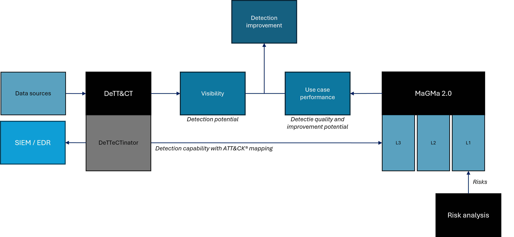

# PRISMA: Prioritized Risk Indicator for Security Monitoring & Analysis

This is the repository for the PRISMA tool. The PRISMA tool supports organisations in implementing the MaGMa use case framework 2.0, and automates its calculations. Additionally, the tool acts as a visualisation and summarization layer on top of DeTT&CT. Functional documentation of the MaGMa use case framework 2.0 can be found in the folder [docs](docs/).

The tool provides insight and guidance to detection engineers and management. The PRISMA tool currently supports MITRE ATT&CK v17.1.

The figure below shows the overview of how MaGMa 2.0 and DeTT&CT are combined to determine detection quality and improvement potential.



## What's in this repository

| Name | Description |
|---|---|
| [`docs/`](docs/) | MaGMa 2.0 functional documentation, in English and Dutch |
| [`examples/`](examples/) | Example DeTT&CT and MaGMa files to try the app |
| [`frontend/`](frontend/) | The PRISMA web application |
| [`templates/`](templates/) | MaGMa Excel template, for preparing many use cases |
| [`tools/`](tools/) | Notebooks that build the ATT&CK catalog and convert Excel files |
| [`LICENCE`](LICENCE) | Licence of this project |

## Installation Instructions

### Install Node.js
If you do not have Node.js installed, please [download](https://nodejs.org/en/download) and install it. After this step, it is assumed that you have Node.js installed with npm as the package manager.

**Note:** Last tested with Node.js v26.10.0 (October 2026). Newer versions are expected to work. You can check your installed version with `node -v`.

### Clone this Repository
```sh
git clone git@github.com:jongstra/prisma.git
```
If you don't have SSH keys set up for GitHub, clone via HTTPS instead:
```sh
git clone https://github.com/jongstra/prisma.git
```

### Enter Project Frontend Directory
```sh
cd prisma/frontend
```

### Install Application and Dependencies
```sh
npm ci
```
This performs a clean install of all dependencies, exactly as pinned in `package-lock.json` (any existing `node_modules` folder is removed automatically).

**Troubleshooting `npm ci` errors:**
- Most errors mean `package.json` and `package-lock.json` are out of sync. Run `npm install` to regenerate the lockfile and try again.
- Make sure your Node.js version is recent enough — see the note under *Install Node.js*.

### Run Application (for Development & Testing)
```sh
npm run dev
```

- To use the application, open the link shown in your terminal (something like `localhost:5173`) in your browser.
- To try out the application, you can load an example DeTT&CT YAML file from [`examples/dettect/`](examples/dettect/), such as `enterprise_large.yaml`, using the big red button on the DeTT&CT page.
- On the MaGMa page, you can load [`examples/magma/example.yaml`](examples/magma/example.yaml) with **Load MaGMa YAML**.
- Alternatively, you can create an example DeTT&CT Data Sources YAML file using the [DeTT&CT Editor](https://rabobank-cdc.github.io/dettect-editor/#/datasources). The resulting YAML file can be saved to your computer, and loaded into the application using the big red button.

## Project Status
This project is currently in development. You may run into unusual behavior and/or bugs.
- DeTT&CT page: works mostly as intended.
- Insights page: works mostly as intended.
- MaGMa page: works mostly as intended.

## Development
- Software Development: Thomas Jongstra
- Conceptual Guidance: Rob van Os
- Overarching Project (Inventarisatie (inter-)departementale capaciteiten cyberweerbaarheid): Rob van Os, Raymond Bierens & Tony van der Togt

## Project Goals
- Helping organizations manage their cyber security use cases (using the MaGMa framework).
- Visualizing the visibility organizations have on their digital infrastructure (using [DeTT&CT](https://github.com/rabobank-cdc/DeTTECT)/[dettectinator](https://github.com/siriussecurity/dettectinator)).
- Integrating DeTT&CT visibility with MaGMa use case management.
- Providing high-level insights and suggestions regarding visibility and use case management.

## Technical Setup
- Web app: Vue 3 and TypeScript (Pinia, Vite). All processing happens in the browser; there is no backend server.
- Tools: Python notebooks that build the ATT&CK catalog and convert Excel files to MaGMa YAML.

## Future
- This project has a strong focus on pragmatism and simplicity for the benefit of the end user. Its design is sometimes strongly opinionated and limited with this goal in mind. New features may be added based on common user needs, but should not undermine this philosophy.

## Thanks
Thanks are extended to the following:
- Dutch Government: The initial development of this project has been funded by the Dutch government. This support has been instrumental for the creation of this project.
- The MITRE Corporation: This project builds on the work of MITRE which provides up-to-date ATT&CK mappings. These mappings form a crucial basis for this project.
- Developers of DeTT&CT: This project extends the work in DeTT&CT and would not have existed without it.
